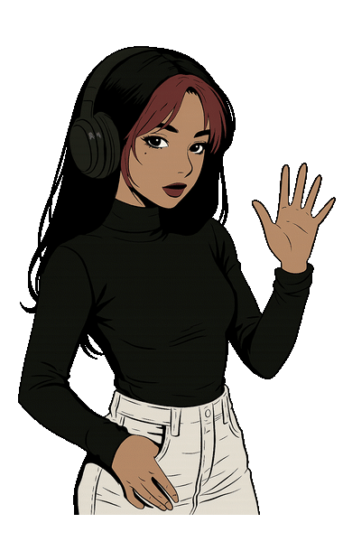

<div align="center">


"Transformando ideas en experiencias digitales elegantes."

</div>

---

<table>
<tr>
<td width="40%" align="center">


</td>
<td width="60%" valign="middle">

## ✨ Sobre mí

🎨 Diseñadora Gráfica&nbsp;&nbsp;·&nbsp;&nbsp;💻 Frontend Developer&nbsp;&nbsp;·&nbsp;&nbsp;🌐 Diseñadora Web

🚀 Apasionada por crear interfaces modernas, minimalistas y con excelente experiencia de usuario.

```ts
const luna = {
    name: "Luna Barreto",
    brand: "Creative Moon",
    role: "Frontend Developer",
    learning: ["React", "TypeScript", "Next.js", "UI/UX"],
    passion: "Building beautiful digital experiences."
}
```

</td>
</tr>
</table>

---

## 🛠 Tech Stack

<p align="center">

</p>

---

## 📊 GitHub Stats

<div align="center">


</div>

<div align="center">

</div>

---

## 🚀 Proyectos Destacados

| Proyecto | Tecnologías |
|----------|-------------|
| 🌙 Creative Moon Portfolio | React • TypeScript • Tailwind |
| 📊 Dashboard Administrativo | React • TanStack Table |
| 🛒 Ecommerce UI | React • Tailwind |
| 🎨 Component Library | React • Storybook |
| 📱 Landing Pages | HTML • CSS • JS |

---

## 🌌 Lo que hago

✔ Interfaces modernas &nbsp;&nbsp;✔ Diseño UI &nbsp;&nbsp;✔ Diseño Responsivo &nbsp;&nbsp;✔ Animaciones
✔ React &nbsp;&nbsp;✔ TypeScript &nbsp;&nbsp;✔ Tailwind CSS &nbsp;&nbsp;✔ Branding &nbsp;&nbsp;✔ Diseño Web

---

## 📈 Actividad

<p align="center">

</p>

## 🐍 Contributions

<p align="center">

</p>

---

## 🌐 Conecta conmigo

<p align="center">
<a href="https://linkedin.com/in/TU_LINKEDIN">

</a>
<a href="https://github.com/luna-barreto">

</a>
<a href="https://TU_PORTAFOLIO.com">

</a>
</p>

<div align="center">

### 🌙 Creative Moon
*"Design. Code. Create."*


</div>
